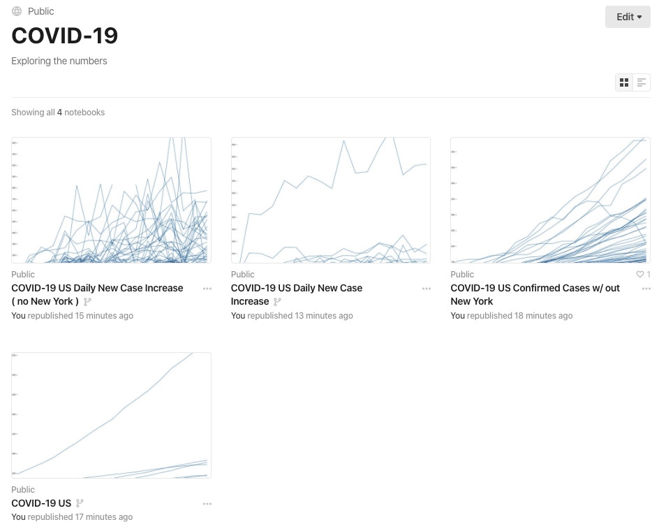

# COVID 19 Data Parser

A utility to parse the COVID 19 data from [John Hopkins](https://github.com/CSSEGISandData/COVID-19)
Some visualizations of this output over here:
<a href="https://observablehq.com/collection/@jsheffie/covid-19">Covid-19 collection</a>

Features
--------

* TODO
